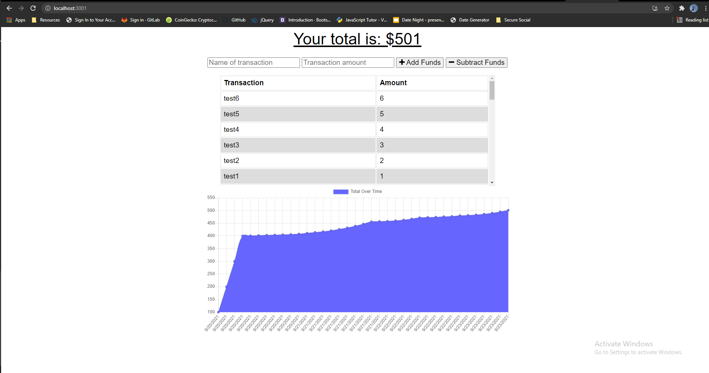

# Budget Tracker PWA

## Developed By: Troy Grossi
### Deployed:
https://tg-budget-tracker-pwa.herokuapp.com/

 
 

# Description

- The purpose of this project was to create a progressive web application from the provided code. 
- The program originally only worked with internet connection. 
- By adding indexedDB functionality, service workers to store cache, and a manifest.json file this program has complete PWA functionality and can be downloaded from the browser.

# Table of Contents

- [Installation](#installation)

- [Usage](#usage)

- [Contribution](#contribution)

- [License](#license)

<!---->

- [Questions](#questions)

# Installation

Download the project from github. Must have node, mongoDb, and npm downloaded on your client. Type "npm install" in the terminal from the root of this project to download the dependencies. From here everything will be up and running.

- Dependencies: express, mongoose

# Usage

- From the root of the directory type "npm start" to start the server
- In your web browser(chrome preferred), navigate to http://localhost:3001/
- You can now track your budget by adding or subtracting funds 
- The graph will update with local data, and the data is stored in a database as well
## Offline functionality:
- IndexedDB will store the user's data on the browser and send it to the database when internet connection returns
- Service workers save the static files, so the program will continue to work without internet connection
- A manifest file allows the client to download the cached files to their local machine by clicking the install button at the top right of the browser's search bar

# Contribution

Refer to:
[Contribution Convenant](https://www.contributor-covenant.org/version/2/0/code_of_conduct/code_of_conduct.md)

# License

MIT

# Questions

Ask questions at my github

- GitHub Link: https://github.com/troygrossi
